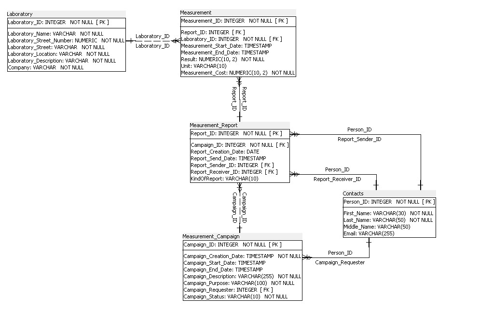

Team:

Name: Stef Henderickx
Studentnr: ..

Year: 2023-2024

Milestone 2: Modellering

TOP DOWN MODELERING
---

Entiteittypes + Attributen + PK

    S2

- W: Laboratory (**Laboratory_ID**, Laboratory_name, Laboratory_Description, Company, Laboratory_Street_Number,
  Laboratory_Street, Laboratory_Location)
- X: Measurements (**Measurement_ID**, Report_ID, Laboratory_ID, Measurement_Start_Date, Measurement_End_Date, Results,
  Unit, Measurement_Cost)
- Y: Reports (**Report_ID**, Campaign_ID, Report_Creation_Date, Report_Send_date, Report_Receiver_ID, Report_Sender_ID,
  Printed_Report)
- Z: Campaigns (**Campaign_ID**, Campaign_Creation_Date, Campaign_Start_Date, Campaign_End_Date, Campaign_Description,
  Campaign_Purpose, Campaign_Requester_ID, Campaign_status)
- Contacts (**Person_ID**, First_Name, Last_Name, Email_address)

Domeinen - constraints

    S2

- Campaigns: Campaign_Status in ( Campaign_Start_Date >= Campaign_Creation_Date )
- Campaigns: Campaign_End_Date > Campaign_Start_Date
- Reports: KindOfReport in ('Paper', 'Email')
- Reports: Report_Send_date > Report_Creation_Date
- Measurements: Measurement_End_Date > Measurement_Start_Date
- Measurement: Result > 0

Tijd
---
S2: Campaign is made, all reports are made after the linked campaign.

Intermediërende  entiteiten
---

- No intermediate entities.

Logisch ERD

    S2: ERD

informatiebehoefte + Normalisatie
---

    S2:

[Informatiebehoefte S2.docx](/D2_NORMALISATIE/S2_normalisatie/Informatie%20behoefte%20S2.docx)

[Informatiebehoefte S2.pdf](/D2_NORMALISATIE/S2_normalisatie/Informatie%20behoefte%20S2.pdf)

[Normalisatie_V3_S2_Laboratory.pdf](/D2_NORMALISATIE/S2_normalisatie/Normalisatie_V4_S2.pdf)

[Normalisatie_V3_S2_Laboratory.xlsx](/D2_NORMALISATIE/S2_normalisatie/Normalisatie_V4_S2.xlsx)

Verschillen na Normalisatie (S2)
-----------------------------------

- made a new table to remove redundancy
- Laboratory_address ==> street + street_number
- changed some datatypes.

