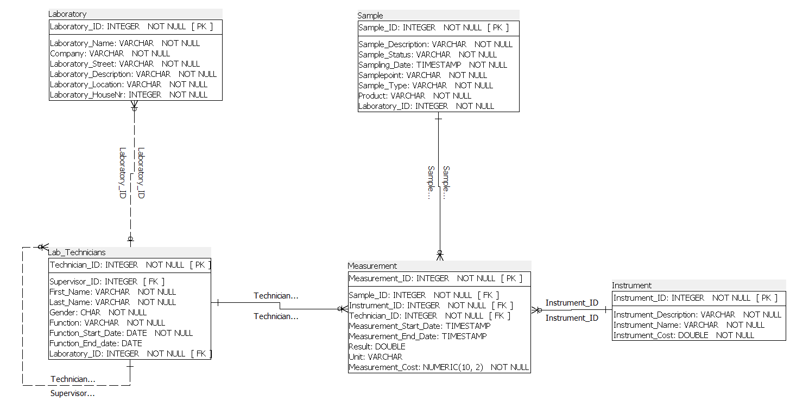
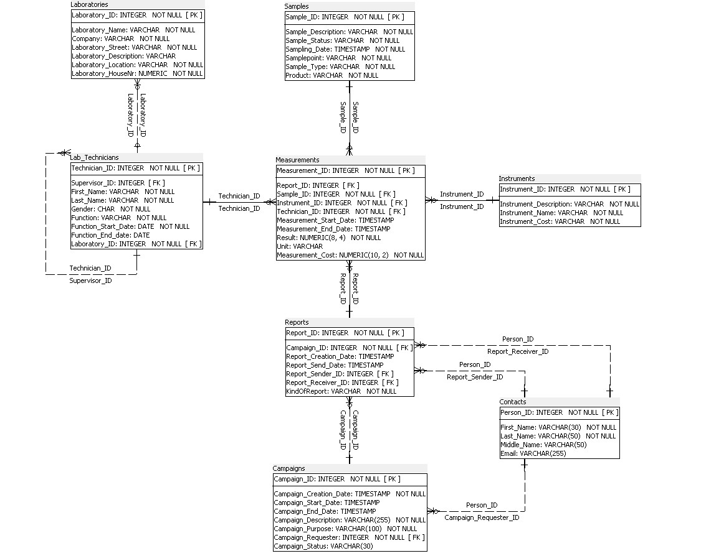

Name: Andreas van Loon (S1)
Studentnr: ...

Name: Stef Henderickx (S2)
Studentnr: ..

Year: 2023-2024

Milestone 2: Modellering

TOP DOWN MODELERING
---

Entiteittypes + Attributen + PK
---
    S1
- A: Lab_Technician (**Technician_ID**, Supervisor_ID, Function, First_name, Last_name, Gender, Function_Start_Date, Function_End_Date)
- B: Sample (**Sample_ID**, Description, Status, Sampling_Date, SamplePoint, Sample_Type, Products)
- C: Instrument ( **Instrument_ID**, Instrument_Description, Instrument_Name, Instrument_Cost)
- D: Measurement ( **measurement_id**, Measurement_Start_date, Measurement_End_Date, Result, unit, measurement_Cost,Technician_ID, Instrument_ID, Sample_ID, Laboratory_ID, Report_ID)
- Laboratory (**Laboratory_ID**, Laboratory_Name, Laboratory_Description, Company, Laboratory_Address, Laboratory_Location)

    S2
- W: Laboratory (**Laboratory_ID**, Laboratory_name, Laboratory_Description, Company, Laboratory_Street_Number, Laboratory_Street, Laboratory_Location)
- X: Measurements (**Measurement_ID**, Report_ID, Laboratory_ID, Measurement_Start_Date, Measurement_End_Date, Results, Unit, Measurement_Cost)
- Y: Reports (**Report_ID**, Campaign_ID, Report_Creation_Date, Report_Send_date, Report_Receiver_ID, Report_Sender_ID, Printed_Report)
- Z: Campaigns (**Campaign_ID**, Campaign_Creation_Date, Campaign_Start_Date, Campaign_End_Date, Campaign_Description, Campaign_Purpose, Campaign_Requester_ID, Campaign_status)
- Contacts (**Person_ID**, First_Name, Last_Name, Email_address)

Domeinen - constraints
--- 
    S1
- Measurement: Measurement_End_Date > Measurement_Start_Date
- Measurement: Result > 0
- Measurement: Measurement_Cost - must contain €
- Sample: Description - minimum 3 characters
- Sample: Status - minimum 2 characters
- Instrument: Instrument_Description - minimum 3 characters
- Instrument: Instrument_Cost - must contain €
- Lab_Technician: gender - M/V
- Lab_Technician: Function_End_Date > Function_Start_Date

    S2
- Campaigns: Campaign_Status in ('initial', 'In Analysis', 'Completed',)
- Campaigns: Campaign_End_Date > Campaign_Start_Date
- Reports: Printed_Report in ('Y', 'N')
- Reports: Report_Send_date > Report_Creation_Date
- Measurements: Measurement_End_Date > Measurement_Start_Date
- Measurement: Result > 0

Tijd 
---
    S1
- Sample: Sampling_date
- Measurement: the date on which a measurement started and ended
- Lab_Technician: the date the technician started working for the lab and if applicable the date he resigned.

    S2
- Campaign is made, all reports are made after the linked campaign.

Intermediërende  entiteiten
---
- Lab_Technician: laboratory - measurement 

Logisch ERD 
---
    S1: ERD

    S2: ERD

informatiebehoefte + Normalisatie
---
    S1:
[informatiebehoefte S1.docx](/D2_NORMALISATIE/S1_normalisatie/Informatie%20behoefte%20S1.docx)

[S1_normalisatie_Laboratories.pdf](/D2_NORMALISATIE/S1_normalisatie/OverzichtsDocument_v3.pdf)

    S2:
[Informatiebehoefte S2.pdf](/D2_NORMALISATIE/S2_normalisatie/Informatie%20behoefte%20S2.pdf)

[S2_normalisatie_Laboratories.pdf](/D2_NORMALISATIE/S2_normalisatie/Normalisatie_V4_S2.pdf)

    SAMEN:
[S1S2_Laboratories_Integration.pdf](/D2_NORMALISATIE/SAMEN_integratie/Normalisatie_V4_SAMEN.pdf)

Verschillen na Normalisatie (SAMEN)
-----------------------------------
- Changed some datatypes

