Milestone 3: Creatie Databank en Security
---

    Identity columns
---
Mandatory:
- A: Lab_Technicians: **Technician_ID**
- B: Samples: **Sample_ID**
- C: Instruments:  **Instrument_ID**
- D: Measurements:  **measurement_id**
- W: Laboraatories: **Laboratory_ID**
- Z: Measurements: **Measurement_ID**
- Y: Reports: **Report_ID**
- x: Campaigns: **Campaign_ID**
- Contacts: **Person_ID**

      Table Counts
---
     Tablecounts
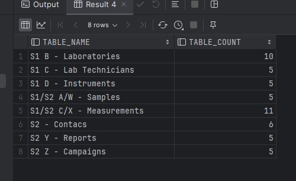

Queries
--- 
    S1 @query 1:  Laboratories - Lab_Technicians (A) - Measurements(D) - Samples(B)
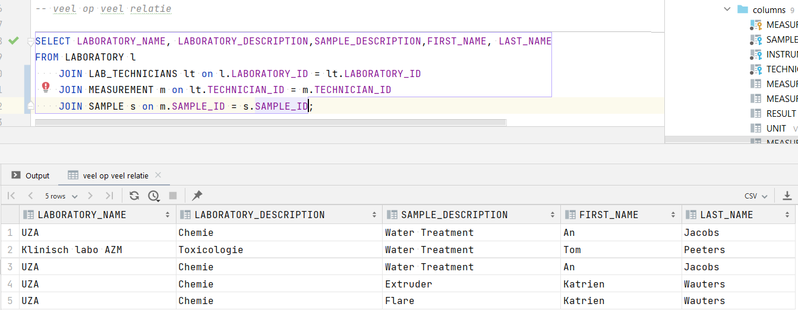

    S1 @query 2:  Measurements (D) - Lab_Technicians (A) - Instruments (C)
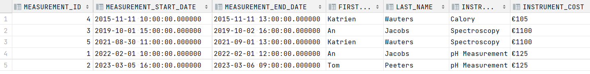

    S2 @query 1:  measurements (X) - reports(Y) - campaigns(Z)

    S2 @query 2: reports (Y) - contacts - CAMPAIGNS (Z)

Bewijs Domeinen - constraints M2
--- 

    S1
- Measurement: Measurement_End_Date > Measurement_Start_Date
  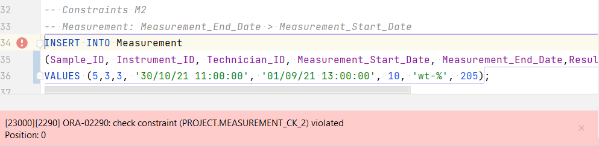
- Measurement: Result > 0
  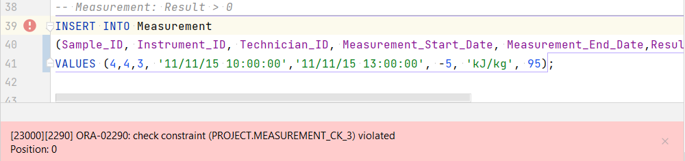
- Sample: Description - minimum 3 characters
  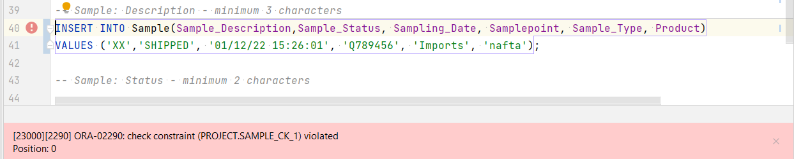
- Sample: Status - minimum 2 characters
  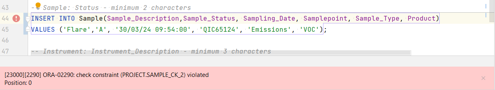
- Instrument: Instrument_Description - minimum 3 characters
  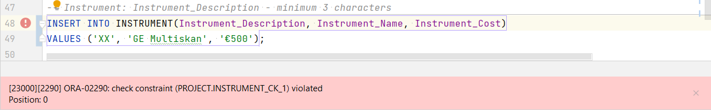
- Instrument: Instrument_Cost - must contain €
  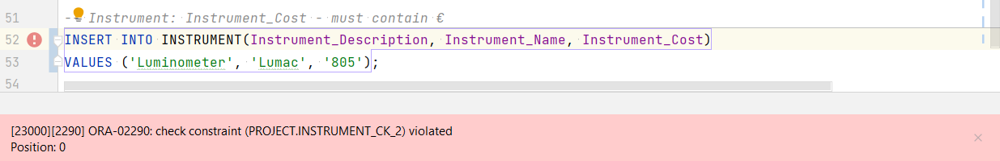
- Lab_Technician: gender - M/V
  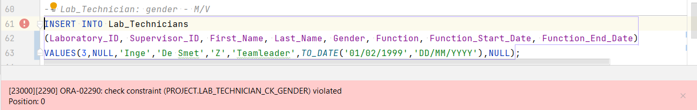
- Lab_Technician: Function_End_Date > Function_Start_Date
  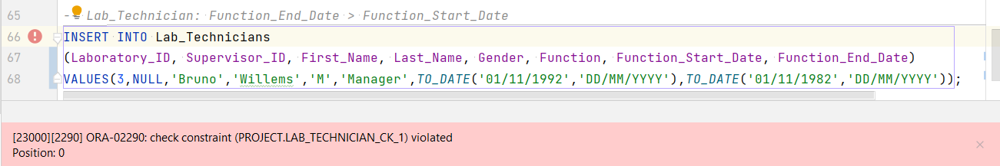

    S2
- Campaigns: Campaign_Status in ( Campaign_Start_Date >= Campaign_Creation_Date )
  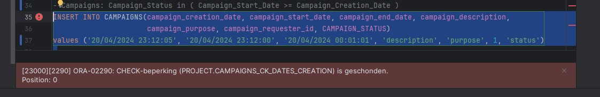
- Campaigns: Campaign_End_Date > Campaign_Start_Date
  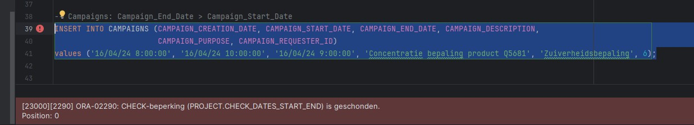
- Reports: KindOfReport in ('Paper', 'Email')
  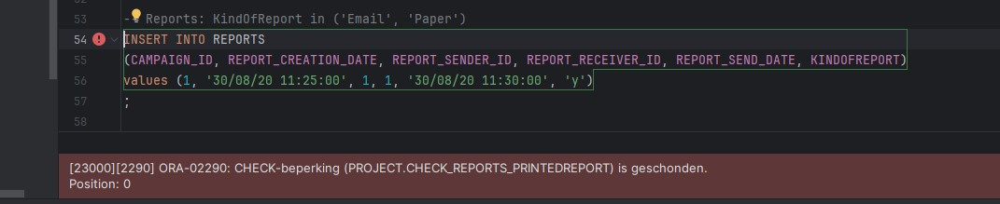
- Reports: Report_Send_date > Report_Creation_Date
  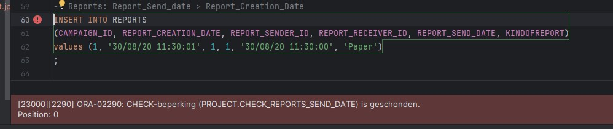
- Measurements: Measurement_End_Date > Measurement_Start_Date
  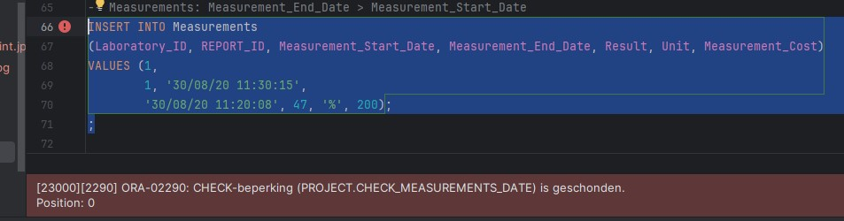
- Measurement: Result > 0
  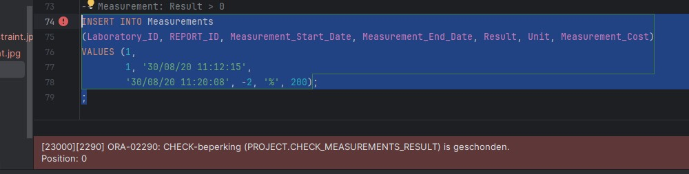

Security
---
    S1: 
- view 

    S2
- view
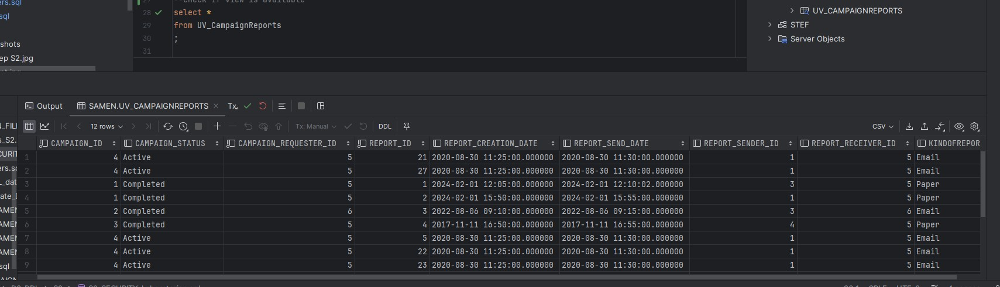 
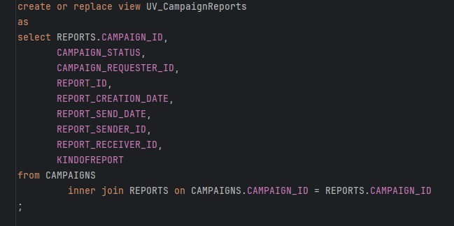

- overzicht system privileges
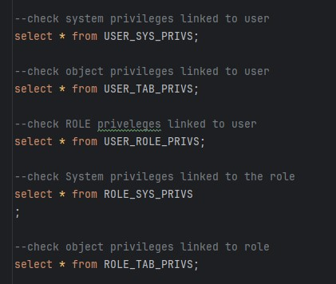

- S1: 

- S2:
