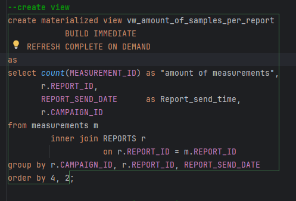

## Milestone 8 Bewijs

**Stef Hendericks - Andreas Van Loon**

### STAT en controle Grootte tabel:

### Tabel voor partionering:

### Query:

### Explain plan:

### grant rights to SAMEN

### Create materialized view

#### select results via view

#### Explain plan Materialized view

### Moeilijkheden:

De moeilijkheid voor mij was hier het kiezen van een juiste refresh mode.
Initieel wou ik de mode op REFRESH FAST zetten.
Dit werd echter gewijgerd door mijn DBMS. 

Na wat opzoek werk in de oracle documentatie werd het duidelijk dat dit een incrementiele 
refresh was en dit niet te combineren is met 'BUILD IMMEDIATE'.

Bij 'BUILD IMMEDIATE' kan enkel een complete refresh gedaan worden. 
Verder had ik ook nog gelezen dat je dit op on commit en on demand gezet kan worden.
Hier heb ik gekozen voor on demand zodat de query waaruit de view bestaat niet bij elke commit
opnieuw uitgevoerd moeten worden.

### Conclusie:
Een materialized view slaagt zijn resultaten op en is daarom performanter. 
Hij haalt de resultaten hierdoor sneller op omdat hij het resultaat niet nog moet 'bouwen' maar kan 
uitlezen uit het geheugen.

Een Materialized view kan nadelig zijn wanneer het gebruikt wordt voor een tabel die veel aangepast moet
worden. Hierdoor moet de query (waar de view mee gemaakt is) vaker herhaalt worden en kan dit nadelige
effecten hebben op de performantie.

